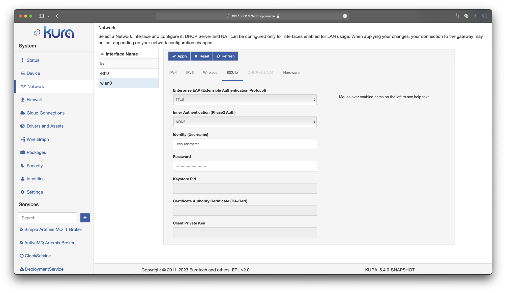
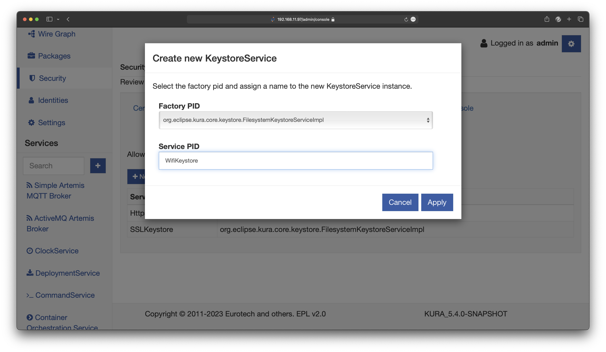
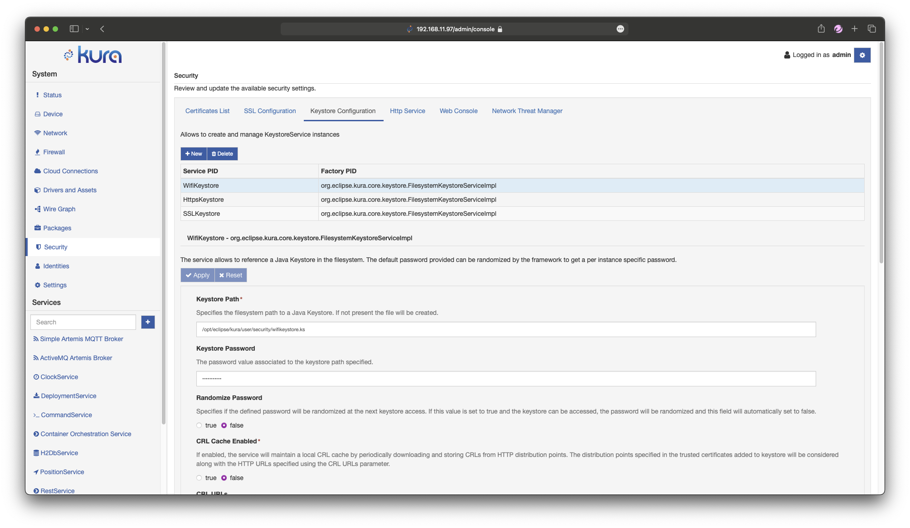
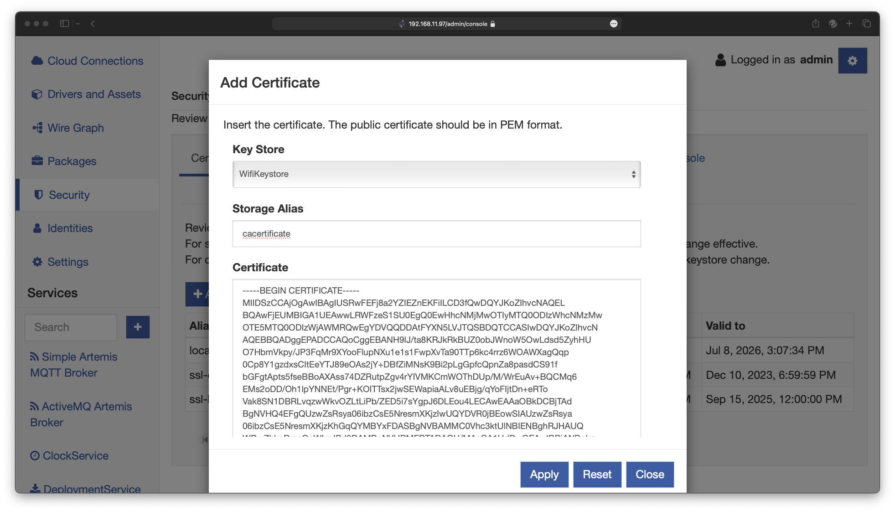

# Wi-Fi 802.1x Configuration

Enterprise Wi-Fi is currently only supported on gateways running our [generic profiles](/getting-started/install-kura/#installer-types). The following is a list of currently supported 802.1x authentication methods.

 - TTLS-MSCHAPv2
 - PEAP-MSCHAPv2
 - TLS-EAP

## Setup TTLS/PEAP-MSCHAPv2
 1. Set up gateway Wi-Fi as described in the [Wi-Fi configuration guide](/gateway-configuration/wifi-configuration/#wireless-configuration).
 2. Ensure Wireless Security is set to `WPA2/WPA3-Enterprise`
    
 3. select the 802.1x tab
 4. Set Enteprise EAP -> `TTLS/PEAP`
 5. Set Inner Authentication -> `MSCHAPV2`
 6. Set `Identity (Username)` 
 7. Set `Password`
 6. Press 'Apply'

The configuration should look like the following:

# Setup TLS-EAP
To connect via TLS-EAP you will need the following items in unencrypted PEM format:
    - Certificate Authority (CA) Certificate
    - Client Certificate + Private Key (PKCS8)

Enrolling secrets in the Keystore service

 1. Navigate to `Security` under the `System` tab.
 2. Under the `Keystore Configuration` add a new keystore, and keep note of the name. 
 3. After the Keystore is created, be sure to change the path to a persistent directory. 
 4. Navigate to the `Certificate List` and create a new Certificate. Insert the PEM and Apply, keep note of the name. 
 5. Now press `add` and create a new Private Key. Insert both the certificates in the PEM in the dialogue and press apply. keep note of the name. 

Wifi Setup

 1. Set up gateway Wi-Fi as described in the [Wi-Fi configuration guide](/gateway-configuration/wifi-configuration/#wireless-configuration).
 2. Ensure Wireless Security is set to `WPA2/WPA3-Enterprise`. 
 3. Select the 802.1x tab.
 4. Set Enteprise EAP -> `TLS`.
 5. Set Inner Authentication -> `MSCHAPV2`.
 6. Set `Identity (Username)`.
 7. Set `Keystore Pid` to the name of the keystore created above.
 8. Set `Certificate Authority Certificate (CA-Cert)` to the name of the certificate created above.
 9. Set the `Client Private Key` to the name of the Private Key created above.

